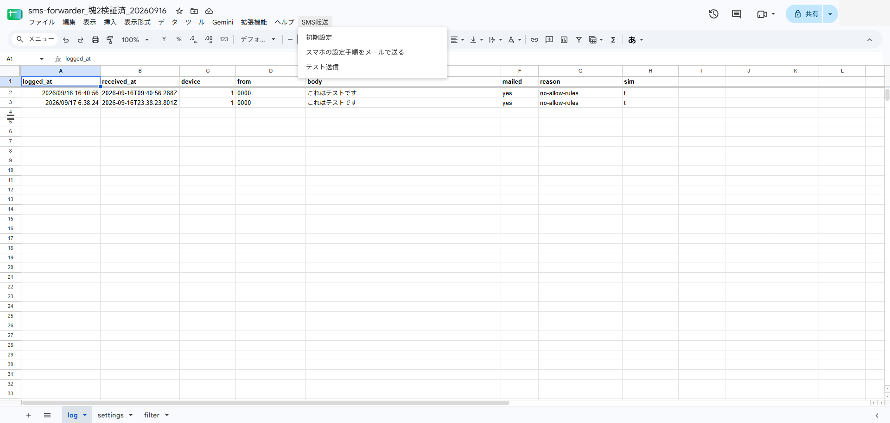
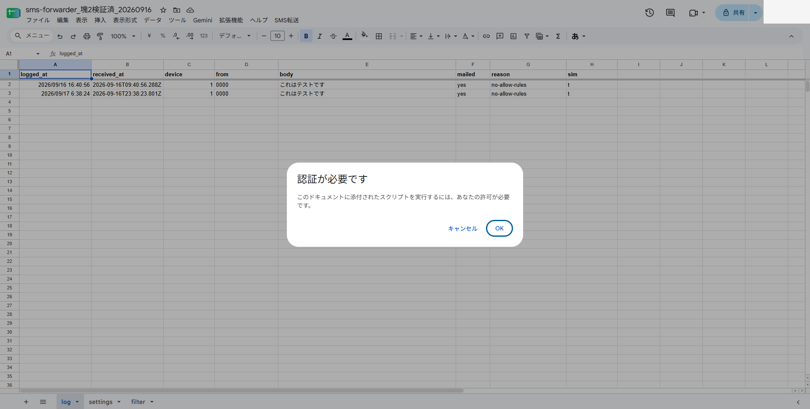
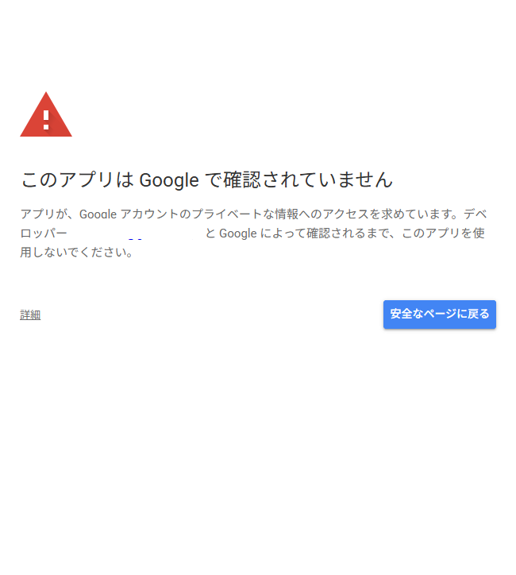
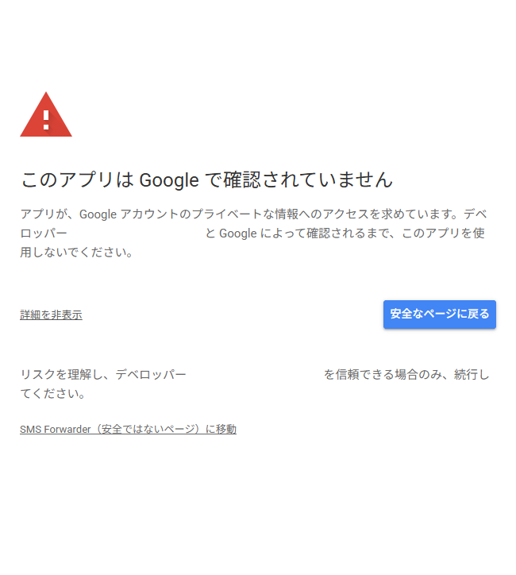
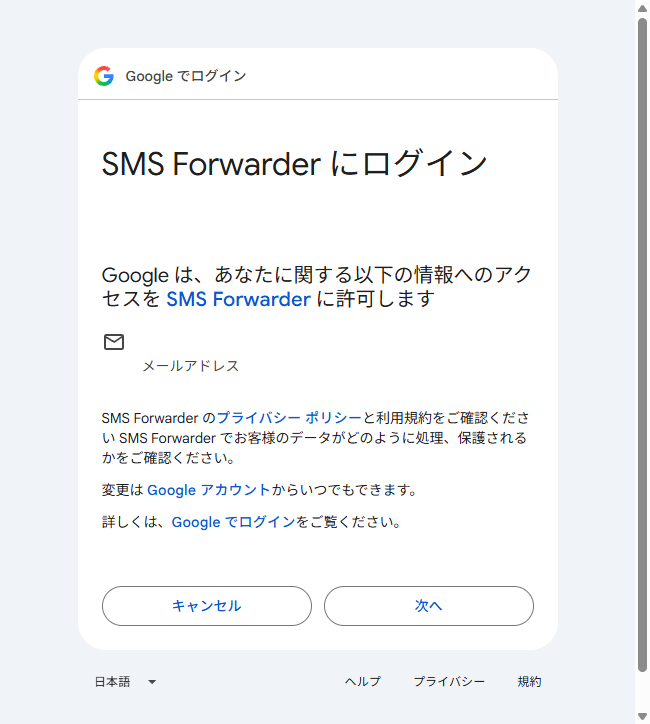
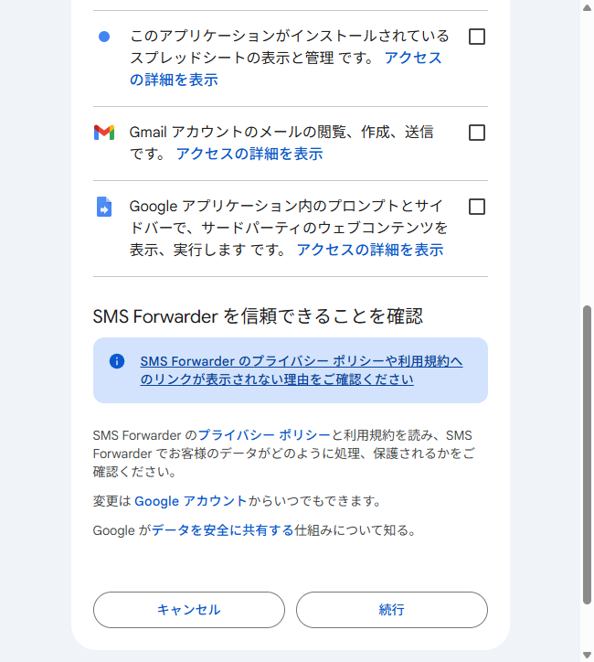
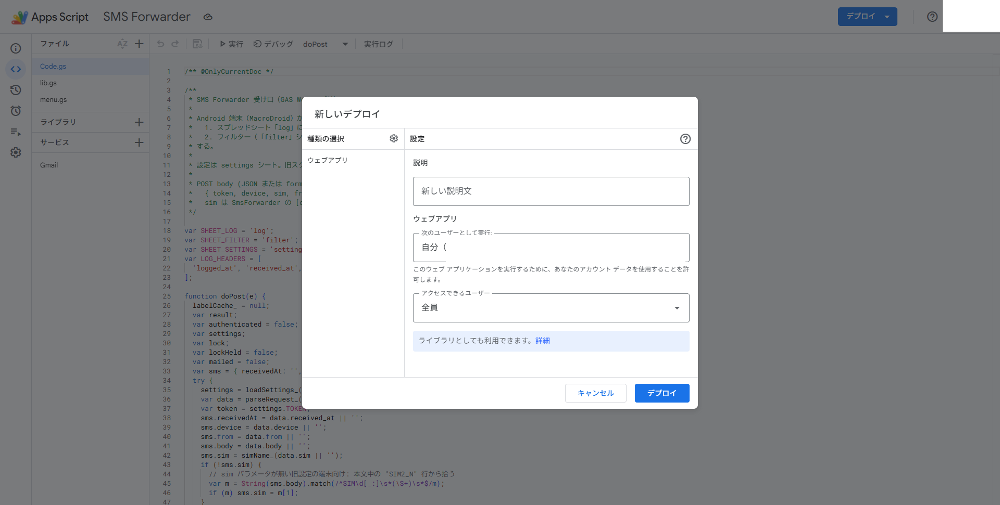
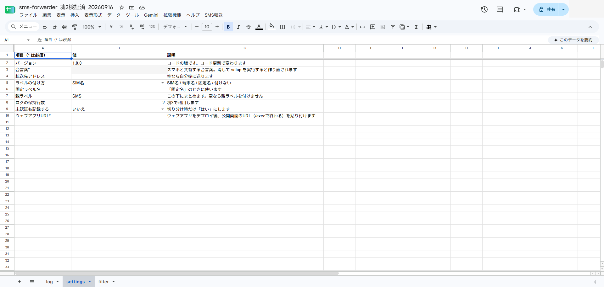

# 初回セットアップ（受け取る人向け）

コピーリンクを受け取ってから、スマホの SmsForwarder が動くまでの通し手順です。
スマホ側の細かい入力値は最後に届く「設定手順メール」に全部埋め込まれているので、
このページは PC で読みながら進める形で十分です。

## 1. スプレッドシートをコピーする

1. 配布されたコピーリンクを開く
2. 「**コピーを作成**」を押す → 自分のドライブにコピーができる

## 2. 初期設定を実行する

1. コピーしたスプレッドシートを開き、少し待つとメニューバーに「**SMS転送**」が出る
2. 「SMS転送」→「**初期設定**」を実行する

   

3. 初回は「認証が必要です」と出るので「**OK**」を押す

   

4. Google の承認画面が開く。「このアプリは Google で確認されていません」と出たら
   「**詳細**」→ 下部の「**SMS Forwarder（安全ではないページ）に移動**」

   
   

5. アカウントの確認画面で「**次へ**」

   

6. スコープの一覧が出ます。要求されるのは
   「このスプレッドシート」「Gmail の閲覧・作成・送信」「メールアドレスの確認」などだけです。
   「**すべて選択**」にチェックして「**続行**」

   
7. 「初期設定が完了しました」と出たら OK。`settings` / `log` / `filter` の3シートができ、
   `settings` には「バージョン」「合言葉*」などの行が入ります（合言葉は自動生成済み）

## 3. ウェブアプリを公開する

1. メニューの「**拡張機能**」→「**Apps Script**」でエディタを開く
2. 右上の「**デプロイ**」→「**新しいデプロイ**」
3. 種類の歯車から「**ウェブアプリ**」を選び、実行ユーザー「**自分**」/ アクセスできるユーザー「**全員**」にして「デプロイ」

   

4. 完了画面に表示された **ウェブアプリの URL**（`https://script.google.com/macros/s/.../exec` で終わる）をコピーする

## 4. URL を settings へ貼る

1. スプレッドシートの `settings` シートを開く
2. 「**ウェブアプリURL\***」行の B 列に、さきほどの URL を貼り付ける

   

   貼り忘れると手順メールが送れません。貼った URL は形式だけを確認し、公開状態は保証しません。
   `/exec` で終わらない・https でない・別ドメインの URL は拒否されるので、デプロイ完了画面の値をそのまま使ってください

## 5. 手順メールを送る

1. 「SMS転送」→「**スマホの設定手順をメールで送る**」を実行
2. 自分の Gmail に「[SMS転送] スマホ側の設定手順（トークン入り）」が届く

## 6. スマホ側を設定する

届いたメールをスマホで開き、書かれている通りに進めます。要点は:

1. SmsForwarder の APK を GitHub Releases からインストール（「提供元不明のアプリ」の許可が要ります）
2. 権限を許可する（SMS・電話・通知の表示。電話の権限が無いと SIM 名が取れずラベルが付きません。
   「通知へのアクセス（Notification listener）」は他アプリの通知転送用なので SMS だけなら不要です。
   Android 13 以降で「制限付き設定」と出たら、設定 → アプリ → SmsForwarder →「⋮」→「制限付き設定を許可」）
3. Device mark（端末名）と SIM の備考（ニックネーム）を付ける — 備考がそのまま Gmail のラベル名になります
4. Sender を Webhook で作り、メールに書かれた URL と Web params をそのまま貼る。
   作成画面の「Test」ボタンを押すと、実 SMS を待たずに GAS への疎通を確認できます（`log` シートに1行増えます）
5. Rule（SMS → All → 作った Sender → 両 SIM）を作って ON

## 7. 確認

別の電話から SMS を1通送り、`[SMS] <番号>` という件名のメールが届けば完了です。
届かないときは [トラブルシューティング](troubleshooting.md) へ。

## 複数台に増やすとき

SmsForwarder の「General settings」→「Backup & restore」で設定をファイルに書き出し、
他の端末で読み込めます。読み込み後に変えるのは **Device mark** だけで構いません。
権限・電池最適化・自動起動の許可は端末ごとに手でやり直してください。

- 更新のやり方: [updating.md](updating.md)
- つまずいたとき: [troubleshooting.md](troubleshooting.md)
